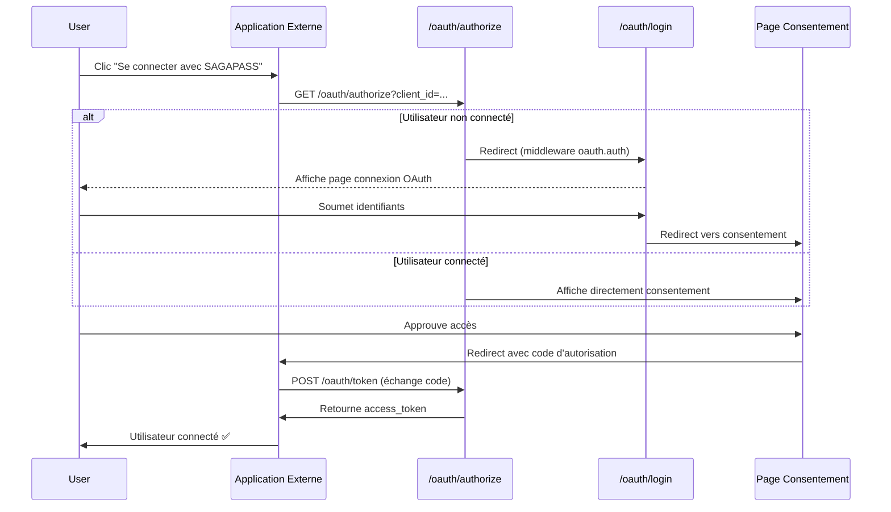

# 🧪 Guide de Test - Page de Connexion OAuth Personnalisée

## ✅ Ce qui a été implémenté

### 1. **Middleware Personnalisé OAuth** (`EnsureAuthenticatedForOAuth`)
- Remplace `auth:web` pour les routes OAuth
- Redirige vers `/oauth/login` au lieu de `/login` standard
- Préserve tous les paramètres OAuth dans la session

### 2. **Page de Connexion OAuth Indépendante**
- **Sans menu** : Page standalone complète
- **Design split-screen** :
  - 🖼️ Logo SAGAPASS à **droite** (sur PC)
  - 📝 Formulaire de connexion à **gauche** (sur PC)
- **Responsive** : S'empile verticalement sur mobile
- **Affiche l'application** : Nom, logo et site web de l'app qui demande l'accès

### 3. **Routes Configurées**
```
GET  /oauth/login          → Page de connexion OAuth
POST /oauth/login          → Traitement de la connexion
GET  /oauth/authorize      → Écran de consentement (protégé par oauth.auth)
POST /oauth/authorize      → Approbation/refus
```

---

## 🚀 Comment Tester

### **Étape 1 : Déconnexion**
Assurez-vous d'être déconnecté :
```
http://127.0.0.1:8000/logout
```

### **Étape 2 : Tester avec l'interface interactive**
1. Ouvrez : `http://127.0.0.1:8000/test-oauth.html`
2. Configurez votre Client ID (ou utilisez celui par défaut)
3. Cliquez sur "🚀 Démarrer OAuth Flow"

### **Étape 3 : Vérifier la redirection**
✅ **Résultat attendu :**
- Redirection vers : `http://127.0.0.1:8000/oauth/login?client_id=...`
- Page affiche :
  - Logo SAGAPASS à droite (fond violet dégradé)
  - Formulaire à gauche (fond blanc)
  - Nom de l'application : "saga test"
  - Site web de l'application

❌ **Ancien comportement (corrigé) :**
- Redirection vers : `http://127.0.0.1:8000/login` (page standard avec menu)

### **Étape 4 : Se connecter**
1. Entrez vos identifiants (email + mot de passe)
2. Cochez "Se souvenir de moi" (optionnel)
3. Cliquez sur "Se connecter"

### **Étape 5 : Vérifier le consentement**
✅ **Résultat attendu :**
- Redirection vers la page de consentement OAuth
- Affiche les permissions demandées
- Boutons "Autoriser" / "Refuser"

---

## 📋 URLs de Test Rapide

### Test de Redirection Simple
```
http://127.0.0.1:8000/test-redirect.html
```

### Test du Flow Complet
```
http://127.0.0.1:8000/test-oauth.html
```

### URL OAuth Directe (pour test manuel)
```
http://127.0.0.1:8000/oauth/authorize?client_id=f395e2f6-8829-463b-80bd-f5af1fb3223c&redirect_uri=http://127.0.0.1:8085/callback&response_type=code&scope=profile&state=test123&code_challenge=E9Melhoa2OwvFrEMTJguCHaoeK1t8URWbuGJSstw-cM&code_challenge_method=S256
```

---

## 🔍 Points de Vérification

### ✅ Checklist de Test

- [ ] **Redirection correcte** : `/oauth/login` au lieu de `/login`
- [ ] **Page indépendante** : Pas de menu navigation
- [ ] **Layout correct** : Logo droite, formulaire gauche (PC)
- [ ] **Responsive** : Empilé verticalement sur mobile
- [ ] **Info application** : Affiche nom et site web de l'app
- [ ] **Paramètres préservés** : Tous les params OAuth dans hidden inputs
- [ ] **Connexion fonctionnelle** : Login redirige vers consentement
- [ ] **Messages d'erreur** : Affiche erreurs de validation
- [ ] **Toggle password** : Bouton œil fonctionne

---

## 🐛 Dépannage

### Problème : Redirection vers `/login` au lieu de `/oauth/login`
**Solution :** 
```bash
php artisan optimize:clear
```

### Problème : Page OAuth ne charge pas
**Vérifier :**
1. Le middleware est bien enregistré dans `bootstrap/app.php`
2. Les routes utilisent `oauth.auth` au lieu de `auth:web`
3. La vue existe : `resources/views/oauth/login.blade.php`

### Problème : Informations de l'application ne s'affichent pas
**Vérifier :**
1. La session contient `oauth_app`
2. L'application existe dans la base de données
3. Le `client_id` est valide

---

## 📁 Fichiers Modifiés/Créés

### Nouveaux Fichiers
- ✅ `app/Http/Middleware/EnsureAuthenticatedForOAuth.php`
- ✅ `resources/views/oauth/login.blade.php`
- ✅ `public/test-redirect.html` (mis à jour)

### Fichiers Modifiés
- ✅ `bootstrap/app.php` - Enregistrement du middleware `oauth.auth`
- ✅ `routes/web.php` - Routes OAuth utilisent `oauth.auth`
- ✅ `app/Http/Controllers/OAuth/OAuthController.php` - Méthodes `showLogin()` et `processLogin()`
- ✅ `app/Http/Middleware/Authenticate.php` - Nettoyé (logique OAuth retirée)

---

## 🎯 Flux OAuth Complet



---

## 📱 Aperçu de la Page

### Sur PC (>768px)
```
┌─────────────────────────────────────────┐
│                                         │
│  FORMULAIRE          │     LOGO         │
│  DE CONNEXION        │    SAGAPASS       │
│  (Gauche)            │   (Droite)       │
│                      │                  │
│  Email: ______       │     🛡️           │
│  Password: ___       │   SAGAPASS        │
│  [ ] Remember        │                  │
│  [Se connecter]      │  ┌────────────┐  │
│                      │  │ saga test  │  │
│  Créer compte | MDP  │  │ localhost  │  │
│                      │  └────────────┘  │
└─────────────────────────────────────────┘
```

### Sur Mobile (<768px)
```
┌─────────────────┐
│   LOGO SAGAPASS  │
│      🛡️         │
│    SAGAPASS      │
│   ┌──────────┐  │
│   │saga test │  │
│   └──────────┘  │
├─────────────────┤
│   FORMULAIRE    │
│   Email: ____   │
│   Pass: ____    │
│ [Se connecter]  │
└─────────────────┘
```

---

## ✅ Test Réussi Si...

1. ✅ Utilisateur non connecté → Redirige vers `/oauth/login`
2. ✅ Page affiche logo SAGAPASS + info application
3. ✅ Connexion réussie → Redirige vers page consentement
4. ✅ Paramètres OAuth préservés tout au long du flux
5. ✅ Design responsive fonctionne sur mobile
6. ✅ Pas de menu navigation visible
7. ✅ Messages d'erreur s'affichent correctement

---

**Date de création :** 19 novembre 2025  
**Version :** 1.0  
**Status :** ✅ Implémentation complète
